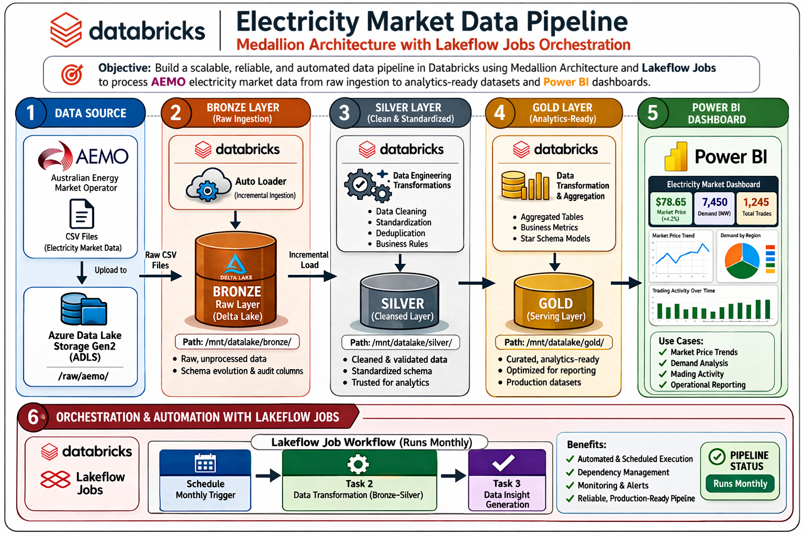

# Energy Market Data Pipeline - Azure Databricks

> Production-grade data engineering pipeline for Australian electricity market analytics and battery dispatch optimisation


---

## Overview

This project builds a production-grade data engineering pipeline on Azure Databricks that ingests electricity market data from the Australian Energy Market Operator (AEMO) and processes it through a Bronze → Silver → Gold medallion architecture to answer a concrete business question: **when should a residential battery system charge the battery during low-price intervals and discharge stored energy back to the grid during high-value periods to maximise economic return?**

Electricity prices in the NEM fluctuate dramatically across 5-minute settlement intervals — from near zero during oversupply to above $10,000/MWh during grid stress events. A battery system acting on stale or unstructured data leaves significant value on the table. This pipeline transforms raw AEMO dispatch data into a near real-time or batch-updated decision signal (with real-time extension planned), surfacing price spike detection, peak demand identification, and actionable charge/discharge recommendations through a Power BI dashboard connected to Databricks via SQL Warehouse.

Built to demonstrate production data engineering practices aligned with the Databricks Data Engineer certification: automated incremental ingestion with Auto Loader, governed storage access via Unity Catalog, orchestrated multi-task pipeline execution with Lakeflow Jobs, and environment-separated DevOps configuration across dev and prod schemas.

---

## Architecture

```
AEMO CSV  →  ADLS Gen2  →  Bronze  →  Silver  →  Gold  →  Power BI
```



---

## Pipeline design

The pipeline follows a medallion architecture across three layers, each with a distinct contract around data quality and purpose. Raw data is never modified — each layer transforms and enriches the previous one, with invalid records quarantined rather than dropped silently.

### Bronze — raw ingestion

Ingested via Databricks Auto Loader reading AEMO `PRICE_AND_DEMAND` CSV files from the ADLS Gen2 landing zone. The Bronze table is append-only and stores data exactly as it arrives — no type casting, no filtering, no transformations. Schema is inferred and tracked automatically by Auto Loader, with file lineage captured via `_metadata.file_path` (Unity Catalog's replacement for `input_file_name()`). Streaming checkpoints ensure exactly-once processing and allow the pipeline to resume from the last processed file without reingesting historical data.

**Table:** `main.energyau_dev_bronze.price_and_demand`

| Column | Description |
|---|---|
| `REGION` | Market region (VIC1, NSW1, etc.) |
| `SETTLEMENTDATE` | Settlement interval timestamp (kept as string in Bronze) |
| `TOTALDEMAND` | Electricity demand in MW |
| `RRP` | Regional reference price |
| `PERIODTYPE` | Market period classification |
| `source_file` | Source file path for lineage |
| `ingested_at` | Ingestion timestamp |

The model uses Regional Reference Price (RRP) as a proxy for export value, acknowledging that actual household feed-in tariffs may differ depending on retailer arrangements.

### Silver — cleaned and validated

Transforms raw Bronze data into a typed, deduplicated, quality-assured dataset suitable for analytics. Transformations applied in this layer:

- `SETTLEMENTDATE` parsed from string to timestamp with consistent formatting
- Time attributes derived: `year`, `month`, `day`, `hour` for efficient downstream aggregation
- Columns renamed to `snake_case` (e.g. `TOTALDEMAND` → `total_demand_mw`)
- Explicit type casting enforced: demand and price cast to `double`, timestamp to `timestamp`
- Null checks, range validation (`demand >= 0`), and duplicate removal applied

Invalid records are not dropped — they are written to `silver_rejects.price_and_demand` for debugging and auditability. The Silver table is the trusted source for all downstream Gold tables.

**Table:** `main.energyau_dev_silver.price_and_demand`

### Gold — business logic and analytics

Four purpose-built tables, each answering a specific operational question. The Gold layer is designed around decisions, not aggregations — every table exists because it drives a distinct action or insight.

| Table | Question it answers |
|---|---|
| `gold_price_signals` | When are prices high or spiking? |
| `gold_demand_signals` | When is the grid under peak stress? |
| `gold_battery_actions` | Should the battery charge, discharge, or idle right now? |
| `gold_market_summary` | What are the overall market trends for reporting? |

The central output is `gold_battery_actions`, which combines price percentile ranking and demand spike flags to emit a `CHARGE_BATTERY`, `DISCHARGE_TO_GRID`, or `IDLE` recommendation for each 5-minute interval. Price signals and demand signals are kept as separate tables because the two measures decouple — price spikes driven by generation shortfalls occur independently of demand peaks, and a battery optimisation strategy needs to act on both patterns distinctly. In the context of grid export optimisation, price acts as the primary revenue signal for discharge decisions, while demand is used as a proxy for grid stress events that often precede extreme price spikes.

**Consumed by:** Power BI semantic model via Databricks SQL Warehouse

---

## Dashboard & results

The Power BI dashboard connects directly to the `gold_battery_actions` table in Databricks via SQL Warehouse, translating raw 5-minute dispatch interval data into operational insights for residential battery management.


### What the dashboard shows

Three visualisations cover the core analytical questions:

**Regional reference price by date** tracks electricity price across every 5-minute settlement interval from January to April 2025 in the VIC1 region. The chart makes price volatility immediately visible — the baseline sits near zero for the majority of intervals, with sharp vertical spikes reaching above $10,000/MWh during high-stress events. These spikes are the primary signal the battery dispatch logic acts on.

**Total demand (MW) by date** shows aggregate grid demand across the same period. The cyclical pattern reflects real consumption behaviour — weekday morning and evening peaks, lower weekend demand, and a gradual demand taper through autumn as heating load decreases.

**Price vs demand overlay** is the most analytically valuable panel. Plotted on dual axes, it surfaces the core insight driving the battery optimisation logic: demand spikes and price spikes are correlated but not identical. There are intervals where demand is elevated but price remains moderate, and — more importantly — intervals where price spikes sharply with only modest demand increases. These decoupled events, driven by generation shortfalls or interconnector constraints rather than raw consumption, represent the highest-value discharge opportunities for a battery system.

### Key insight

Peak demand and peak price move together most of the time, but the exceptions are where battery value is created. A battery dispatching purely on demand signals would miss the price-driven spikes that occur independently of consumption load. The pipeline's Gold layer separates these two signals — `gold_price_signals` and `gold_demand_signals` as distinct tables — precisely to capture both patterns and combine them in the `gold_battery_actions` dispatch recommendation.

### Data coverage

| Attribute | Value |
|---|---|
| Region | VIC1 (Victoria) |
| Period | January — April 2025 |
| Granularity | 5-minute settlement intervals |
| Source | AEMO PRICE_AND_DEMAND |
| Refresh | Static snapshot (DirectQuery planned) |

---

## Key engineering decisions

These are the non-obvious choices made during development - decisions where the obvious path didn't work or wasn't the right fit, and why the alternatives were chosen instead.

### `_metadata.file_path` instead of `input_file_name()`

The Bronze ingestion notebook originally used `input_file_name()` to capture the source file path for data lineage. Unity Catalog does not permit this function — it raises an `AnalysisException` at runtime. The workaround is to use the `_metadata.file_path` column exposed by Auto Loader's internal metadata struct, which Unity Catalog allows and which provides the same information: the full ADLS path of the file that produced each row. This column is aliased to `source_file` on write and serves as the lineage anchor for debugging and auditability across all downstream layers.

**Why it matters:** This is a Unity Catalog-specific constraint that isn't documented prominently. Hitting it in production and resolving it without falling back to legacy authentication is a meaningful signal that the pipeline is genuinely governed rather than just technically functional.

### Gold layer redesigned around business questions, not aggregation types

The initial Gold layer produced multiple tables that overlapped significantly — hourly aggregates, daily aggregates, and regional summaries that largely duplicated each other with different time windows. The layer was refactored entirely around the question: *what decision does this table support?*

The result is four tables with non-overlapping purposes: price spike detection, demand peak identification, battery dispatch recommendations, and market summary reporting. Each table exists because it answers a question that no other table answers. The price and demand signal tables are kept separate — rather than joined — because the two measures decouple in practice. Price spikes driven by generation shortfalls occur independently of demand peaks, and a battery system needs to act on each pattern distinctly.

**Why it matters:** Most pipeline tutorials produce Gold tables that are just aggregated Silver. Organising Gold around business questions forces clarity about what the pipeline is actually for, and produces a data model that stakeholders can reason about without understanding the underlying pipeline logic.

### `trigger(availableNow=True)` over continuous streaming

Auto Loader supports two trigger modes: continuous streaming, which processes records as they arrive, and `trigger(availableNow=True)`, which processes all currently available files then stops. The pipeline uses the latter, scheduled via Lakeflow Jobs on a fixed cadence.

The choice was deliberate. The source data — AEMO dispatch files — arrives in discrete file drops rather than as a true stream. Continuous streaming would keep a cluster alive between file arrivals, burning compute for no throughput gain. `trigger(availableNow=True)` processes each file drop completely, checkpoints progress, and terminates — making it cost-efficient while preserving all the incremental ingestion guarantees of Structured Streaming: exactly-once processing, schema tracking, and checkpoint-based resumption.

**Why it matters:** The distinction between trigger modes is a common exam and interview topic. Choosing `availableNow` over continuous streaming demonstrates cost awareness alongside technical correctness — a signal that the pipeline was designed for production operation, not just to run.

### Directory listing mode over Event Grid notifications

Auto Loader supports two file discovery mechanisms: directory listing, which polls the landing zone for new files, and file notification mode, which uses Azure Event Grid to push notifications when files arrive. The pipeline runs in directory listing mode because Event Grid subscription provisioning failed during setup due to insufficient IAM permissions on the subscription scope.

Rather than blocking on a permissions escalation, the pipeline was reconfigured to use directory listing with an appropriate polling interval. For the current data volume and ingestion cadence this is functionally equivalent — the latency difference between push and poll notification is immaterial when files arrive on a scheduled basis rather than continuously.

**Why it matters:** Documenting this openly is more credible than pretending it didn't happen. In production, the preference would be Event Grid for lower latency and reduced API call overhead — and enabling it requires granting the Databricks Access Connector the `EventGrid EventSubscription Contributor` role at the storage account scope.

### Environment separation via schema naming rather than separate catalogs

Unity Catalog's free tier constrains catalog creation. Rather than provisioning separate `dev` and `prod` catalogs, the pipeline implements environment separation through schema naming conventions within the `main` catalog: `energyau_dev_bronze`, `energyau_dev_silver`, `energyau_dev_gold` for development, with equivalent `energyau_prod_*` schemas for production promotion.

Environment is controlled via a Databricks widget parameter passed through the Lakeflow Job at runtime, resolved in the centralised `/config/config` notebook to produce fully-qualified table references. The same notebook code runs in both environments without modification.

**Why it matters:** This is a pragmatic production pattern when full catalog separation isn't available. It demonstrates understanding of the underlying goal — environment isolation — and the ability to achieve it within real infrastructure constraints rather than assuming ideal conditions.

---

## Tech stack

| Layer | Technology |
|---|---|
| Cloud platform | Microsoft Azure |
| Compute | Azure Databricks (Premium) |
| Storage | Azure Data Lake Storage Gen2 |
| Table format | Delta Lake |
| Governance | Unity Catalog |
| Ingestion | Databricks Auto Loader |
| Orchestration | Lakeflow Jobs |
| Authentication | Azure Managed Identity (Access Connector) |
| Visualisation | Power BI (SQL Warehouse connection) |
| Language | Python / PySpark |

---

## Repo structure

```
├── config/
│   ├── config.py          # environment / table references
│   └── init.py            # schema creation
├── ingestion/
│   └── bronze_autoloader.py
├── transformation/
│   ├── silver_transform.py
│   └── gold_tables.py
├── validation/
│   ├── validate_bronze.py
│   └── validate_silver.py
├── docs/
│   ├── architecture.png
│   └── dashboard.png
└── README.md
```

---

## Roadmap

- [ ] Real-time ingestion via Open Electricity API with `trigger(processingTime="5 minutes")`
- [ ] XGBoost battery action classifier with MLflow experiment tracking
- [ ] Multi-region expansion (VIC1, NSW1, QLD1, SA1, TAS1)
- [ ] Event Grid file notification mode (requires `EventGrid EventSubscription Contributor` IAM role)
- [ ] DirectQuery connection replacing static Power BI snapshot
