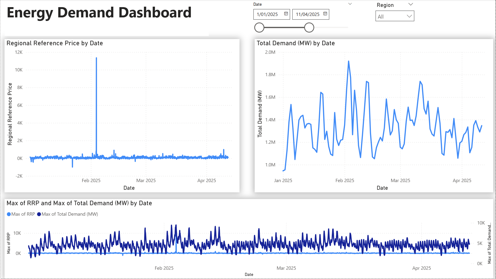

# Project Summary - 12/03/2026

# Energy Market Data Pipeline – Databricks (Azure)

## 1. Project Objective

The goal of this project is to build a **production-style data engineering pipeline in Azure Databricks** that ingests electricity market data from the **Australian Energy Market Operator (AEMO)** and processes it through a **Bronze → Silver → Gold Medallion architecture**.

The processed data will later support analytics such as:

- electricity demand patterns
- price spike detection
- peak grid stress periods
- battery charge/discharge optimization

The project is also designed to practice the concepts required for the **Databricks Data Engineer certification**, including:

- Lakeflow Connect (data ingestion)
- Lakeflow Jobs (pipeline orchestration)
- Spark Declarative Pipelines
- DevOps best practices for data engineering

---

# 2. Cloud Architecture Setup

The project environment was built using **Azure Databricks integrated with Azure Data Lake Storage Gen2 (ADLS)**.

The architecture follows a modern **Databricks Unity Catalog governance model**.

Pipeline architecture:

```
AEMO CSV Data
        ↓
Azure Data Lake Storage (ADLS Gen2)
        ↓
Unity Catalog External Location
        ↓
Databricks Auto Loader
        ↓
Bronze Delta Tables
        ↓
Silver Transformations
        ↓
Gold Analytics Tables
```

---

# 3. Azure Infrastructure Configuration

## Storage Account

Created an ADLS Gen2 storage account:

```
energyau2026vtk
```

Container:

```
energyau2026
```

Storage structure:

```
energyau2026
│
├── landing
│     ├── price_and_demand
│     ├── operational_demand
│     └── public_prices
│
├── checkpoints
│
└── schemas
```

Purpose of each folder:

| Folder      | Purpose                     |
| ----------- | --------------------------- |
| landing     | raw ingestion files         |
| checkpoints | streaming checkpoint state  |
| schemas     | Auto Loader schema tracking |

---

# 4. Unity Catalog Governance Setup

The Databricks workspace was upgraded to **Premium** to enable **Unity Catalog**.

Unity Catalog objects were created to securely manage storage access.

## Storage Credential

A **Storage Credential** was created using an **Azure Managed Identity (Access Connector)**.

This replaced the older authentication method:

```
spark.conf.set(storage_key)
```

Modern authentication architecture:

```
Databricks Access Connector
        ↓
Storage Credential
        ↓
External Location
        ↓
ADLS Storage
```

---

## External Location

An external location was created to map the storage container to Unity Catalog.

Example path:

```
abfss://energyau2026@energyau2026vtk.dfs.core.windows.net/
```

The external location allows Databricks to securely read and write data in ADLS.

---

# 5. Azure IAM Configuration

To enable Auto Loader and Unity Catalog access, the Databricks Access Connector was granted the following Azure roles:

| Role                                    | Purpose                              |
| --------------------------------------- | ------------------------------------ |
| Storage Blob Data Contributor           | read/write ADLS files                |
| Storage Queue Data Contributor          | create queues for file notifications |
| EventGrid EventSubscription Contributor | create event grid subscriptions      |
| Storage Account Contributor             | manage storage resources             |

These permissions enable Databricks to integrate with Azure storage services.

---

# 6. Bronze Ingestion Pipeline

A streaming ingestion pipeline was implemented using **Databricks Auto Loader**.

Auto Loader reads files from the **landing zone** and loads them into a **Delta Lake Bronze table**.

Data source:

```
AEMO PRICE_AND_DEMAND CSV files
```

Example fields:

| Column         | Description                   |
| -------------- | ----------------------------- |
| REGION         | market region (VIC1, NSW1)    |
| SETTLEMENTDATE | settlement interval timestamp |
| TOTALDEMAND    | electricity demand (MW)       |
| RRP            | regional reference price      |
| PERIODTYPE     | market period classification  |

---

# 7. Auto Loader Configuration

The ingestion notebook configures Auto Loader using **cloudFiles**.

Important configuration settings:

| Option                      | Purpose                           |
| --------------------------- | --------------------------------- |
| cloudFiles.format           | specify CSV format                |
| cloudFiles.schemaLocation   | store inferred schema             |
| cloudFiles.useNotifications | disabled (directory listing mode) |
| checkpointLocation          | track processed files             |

Since file notification provisioning failed, the pipeline currently runs using:

```
directory listing mode
```

instead of Event Grid.

---

# 8. Bronze Table Design

The Bronze table captures raw ingestion data with minimal transformations.

Example table:

```
energyau_2026.bronze.price_and_demand
```

Columns:

| Column         | Purpose             |
| -------------- | ------------------- |
| REGION         | market region       |
| SETTLEMENTDATE | kept as string      |
| TOTALDEMAND    | electricity demand  |
| RRP            | electricity price   |
| PERIODTYPE     | market period type  |
| source\_file   | source file path    |
| ingested\_at   | ingestion timestamp |

---

# 9. Unity Catalog Metadata Handling

Unity Catalog does not allow the function:

```
input_file_name()
```

Instead, ingestion metadata is captured using:

```
_metadata.file_path
```

This column records the source file path for data lineage and debugging.

---

# 10. Streaming Execution Mode

The ingestion pipeline uses:

```
trigger(availableNow=True)
```

This runs Auto Loader in **triggered batch mode**.

Execution behavior:

```
Start pipeline
      ↓
Process all available files
      ↓
Write to Delta table
      ↓
Stop automatically
```

This mode is commonly used in production pipelines orchestrated by scheduled jobs.

---

# 11. Current Pipeline State

The system now successfully performs:

```
ADLS landing
     ↓
Auto Loader
     ↓
Bronze Delta Table
```

The pipeline supports:

- incremental ingestion
- schema tracking
- file lineage
- streaming checkpoints

---

# 12. Next Steps (Planned)

The next stage of the pipeline will implement the **Silver layer**.

Silver transformations will:

```
bronze.price_and_demand
        ↓
parse settlement timestamp
        ↓
derive time attributes
        ↓
data validation
        ↓
silver.price_and_demand
```

Future Gold analytics will include:

- demand trend analysis
- price spike detection
- peak demand identification
- battery dispatch recommendations

---

# 13. Certification Concepts Covered

This project already demonstrates several key Databricks Data Engineer topics.

| Exam Topic                  | Implementation                  |
| --------------------------- | ------------------------------- |
| Lakeflow Connect            | Auto Loader ingestion           |
| Spark Declarative Pipelines | streaming data transformation   |
| Unity Catalog               | governance and access control   |
| DevOps for Data Engineering | checkpoints and schema tracking |
| Delta Lake                  | Bronze Delta tables             |

---

# 14. Current Architecture

The current pipeline architecture is:

```
AEMO CSV Files
        ↓
ADLS Landing Zone
        ↓
Unity Catalog External Location
        ↓
Databricks Auto Loader
        ↓
Bronze Delta Table
```

# Project Summary - 30/03/2026

# 12. Silver Layer – Data Transformation & Quality

The Silver layer transforms raw Bronze data into **clean, structured, and reliable datasets** suitable for analytics.

This stage focuses on:

- data standardisation
- type enforcement
- enrichment
- data quality validation

Pipeline flow:

```
bronze.price_and_demand
        ↓
data parsing & cleaning
        ↓
validation rules applied
        ↓
silver.price_and_demand
```

---

## 13. Silver Transformation Logic

The following transformations were applied:

### Timestamp Parsing

- Converted `SETTLEMENTDATE` from string → timestamp
- Ensured consistent time format across all records

---

### Derived Time Attributes

Additional analytical fields were created:

- year
- month
- day
- hour

These fields enable efficient aggregation in the Gold layer.

---

### Column Standardisation

- Renamed columns to consistent naming convention:
  - lowercase
  - snake\_case

Example:

```
TOTALDEMAND → total_demand_mw
```

---

### Data Type Enforcement

Explicit casting applied to ensure consistency:

- demand → double
- price → double
- timestamp → timestamp

This prevents downstream schema inconsistencies.

---

## 14. Data Quality Validation (Silver Layer)

Data quality checks were introduced to ensure reliability.

Validation rules:

| Rule               | Description                      |
| ------------------ | -------------------------------- |
| Null check         | critical fields must not be null |
| Range check        | demand must be ≥ 0               |
| Duplicate check    | remove duplicate records         |
| Schema consistency | enforce correct data types       |

---

## 15. Invalid Data Handling

Invalid records are separated into a dedicated table:

```
silver_rejects.price_and_demand
```

This enables:

- debugging
- monitoring data issues
- auditability

---

## 16. Silver Table Output

Cleaned data is written to:

```
main.energyau_dev_silver.price_and_demand
```

This table serves as the **trusted source** for downstream analytics.

---

# 17. Gold Layer – Business-Level Data Transformation

The Gold layer transforms Silver data into **analytics-ready datasets aligned with business use cases**.

Unlike Bronze and Silver, the Gold layer is designed around:

```
decision-making
```

---

## 18. Gold Layer Design Principles

The Gold layer was redesigned to avoid redundancy and ensure each table serves a **distinct business purpose**.

Each table answers a specific question:

- When are electricity prices high?
- When is the grid under stress?
- What action should a battery system take?
- What are the overall trends?

---

## 19. Gold Tables Implemented

### 1. Price Signals Table

```
gold_price_signals
```

Purpose:

- identify high-price intervals
- detect price spikes

Contains:

- timestamp
- region
- rrp
- price percentile
- spike flag

---

### 2. Demand Signals Table

```
gold_demand_signals
```

Purpose:

- detect peak demand periods
- identify grid stress

Contains:

- timestamp
- total demand
- demand percentile
- ramp changes
- peak demand flag

---

### 3. Battery Decision Table (Core Output)

```
gold_battery_actions
```

Purpose:

- provide actionable insights for battery optimisation

Contains:

- timestamp
- region
- price
- demand
- spike indicators
- recommended action:
  - CHARGE
  - DISCHARGE
  - IDLE

This table represents the **final business outcome of the pipeline**.

---

### 4. Market Summary Table

```
gold_market_summary
```

Purpose:

- support dashboard visualisation

Contains:

- time-based aggregations
- average price
- peak price
- average demand
- spike counts

---

# 20. Removal of Redundant Gold Tables

Initially, multiple Gold tables produced overlapping insights.

These were refactored to:

- eliminate duplication
- align each table with a clear business use case
- improve clarity for stakeholders

---

# 21. Job Orchestration – Lakeflow Jobs

The pipeline is orchestrated using **Databricks Lakeflow Jobs**, enabling automated and reliable execution.

---

## Job Structure

```
Task 0 → init_environment
Task 1 → bronze_ingestion
Task 2 → validate_bronze
Task 3 → silver_transformation
Task 4 → validate_silver
Task 5 → gold_transformation
```

---

## Features Implemented

- task dependencies
- retry logic
- parameter passing (ENV)
- scheduled execution
- failure handling

---

# 22. Data Validation & Completion Checks

Validation steps were added to ensure data integrity at each stage.

---

## Bronze Validation

- ensure data ingestion completed
- verify row count > 0

---

## Silver Validation

- ensure no null values in critical fields
- verify data quality rules applied

---

## Completion Checks

Pipeline enforces:

```
fail fast if data is invalid
```

This prevents bad data from propagating downstream.

---

# 23. DevOps Implementation

The pipeline was enhanced with DevOps best practices to ensure scalability and maintainability.

---

## Centralized Configuration

A reusable configuration notebook was created:

```
/config/config
```

Handles:

- environment (dev/prod)
- table naming
- schema references

---

## Environment Parameterization

Used widgets to dynamically control environment:

```
dev → prod
```

Same codebase runs across environments without modification.

---

## Initialization Layer (Infrastructure Setup)

A dedicated initialization notebook was implemented:

```
/config/init
```

Responsibilities:

- create schemas if not exists
- standardize environment setup

---

## Schema Strategy

Due to Unity Catalog storage limitations:

- used `main` catalog
- implemented environment-based schema separation

Example:

```
main.energyau_dev_bronze
main.energyau_dev_silver
main.energyau_dev_gold
```

---

## Modular Notebook Design

Pipeline split into reusable components:

- ingestion
- transformation
- validation
- analytics

---

# 24. Current Pipeline State

The system now performs:

```
ADLS Landing
     ↓
Bronze Ingestion
     ↓
Silver Transformation + Validation
     ↓
Gold Business Tables
     ↓
Job Orchestration
```

# 25. Gold Layer – Analytics Output & Dashboard Integration

The Gold layer outputs are designed to serve as the **single source of truth for business intelligence and dashboarding**.

These tables are consumed directly by **Power BI** to enable:

- real-time decision support
- interactive analysis
- stakeholder reporting

Pipeline flow:

```
silver.price_and_demand
        ↓
gold transformations
        ↓
gold tables (analytics-ready)
        ↓
Power BI dashboard
```

---

## 26. Semantic Modelling (Power BI Layer)

To support scalable and structured analytics, a **semantic model** was implemented in Power BI.

This layer translates raw data into **business-readable insights**.

---

### Model Structure (Star Schema)

The model follows a **star schema design**:

```
           dim_date
              |
              |
dim_region — fact_battery_dispatch — other fact tables
```

---

### Fact Table (Central Table)

```
fact_battery_dispatch
```

Represents:

- energy market events at each timestamp

Contains:

- timestamp
- region
- price (rrp)
- demand
- action (charge/discharge/hold)

This serves as the **core analytical dataset**.

---

### Dimension Tables

### Date Dimension

```
dim_date
```

Provides time-based context:

- date
- year
- month
- hour

Enables:

- time-based filtering
- trend analysis
- aggregation

---

### Region Dimension

```
dim_region
```

Provides geographic context:

- region

Enables:

- regional filtering
- comparison across markets

---

## 27. Relationship Design

Relationships were defined to ensure **consistent filtering and performance optimisation**.

| From (Fact) | To (Dimension) |
| ----------- | -------------- |
| timestamp   | dim\_date      |
| region      | dim\_region    |

Configuration:

- cardinality: many-to-one (\*:1)
- filter direction: single

This ensures:

- controlled filtering
- efficient query execution

---

## 28. Handling Multiple Fact Tables

Additional Gold tables:

- price signals
- demand signals
- market summary

These were integrated into the model using **shared dimension tables** instead of direct joins.

This avoids:

- ambiguous relationships
- incorrect aggregations
- model complexity

---

## 29. Measures (Business Calculations)

Key business metrics were implemented using DAX measures.

Examples:

- average price
- peak demand
- spike count
- latest battery action

These measures provide:

- dynamic calculations
- reusable logic
- consistent reporting

---

## 30. Dashboard Design Principles

The dashboard was designed to support **decision-making rather than data exploration**.

---

### Key Design Goals

- clarity over complexity
- minimal but meaningful visuals
- actionable insights

---

### Dashboard Structure

### Executive Summary

- average price
- peak price
- demand indicators
- current battery action

---

### Price vs Demand Analysis

- trend of price and demand over time
- identification of price spikes

---

### Grid Stress & Peak Detection

- high-demand intervals
- stress periods

---

### Battery Decision Insights

- recommended action (charge/discharge/hold)
- based on price signals

---

## 31. Dashboard Connectivity

Power BI was connected to Databricks using:

- SQL Warehouse
- personal access token (PAT) authentication

For portfolio deployment:

- switched to **Import mode**
- ensured dataset is self-contained
- removed dependency on live connection

---

## 32. Data Refresh Strategy

For production scenarios:

- DirectQuery or scheduled refresh would be used

For this project:

- static snapshot used for stability
- ensures consistent behaviour when published

---

## 33. Dashboard Deployment

The dashboard was published using:

```
Power BI Service → Publish to Web
```

This enables:

- public access
- embedding in portfolio
- sharing via link

---

## 34. Final Architecture (End-to-End)

The complete pipeline now operates as:

```
AEMO Data (CSV)
     ↓
ADLS Gen2 (Landing)
     ↓
Bronze (Raw Ingestion)
     ↓
Silver (Clean + Validated)
     ↓
Gold (Business Logic Tables)
     ↓
Power BI Semantic Model
     ↓
Interactive Dashboard
```

---

## 35. Key Outcome

The system delivers:

- structured energy market analytics
- detection of price and demand patterns
- actionable battery optimisation insights

Most importantly:

```
Transforms raw energy data into decision-ready intelligence
```

The dashboard layout:


